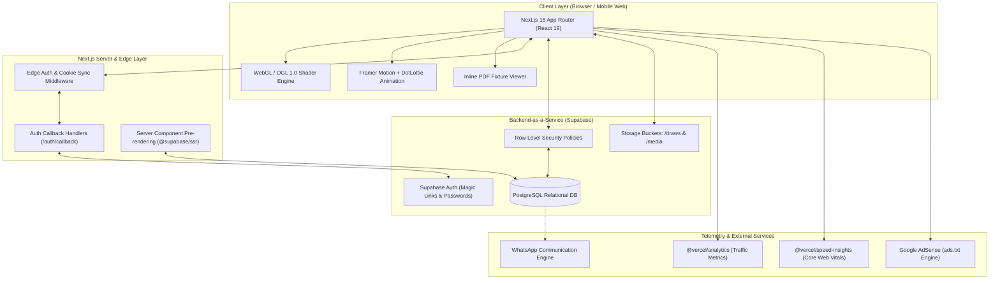
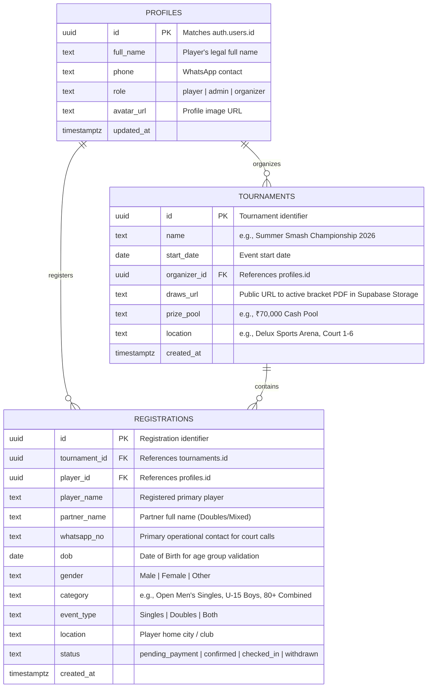
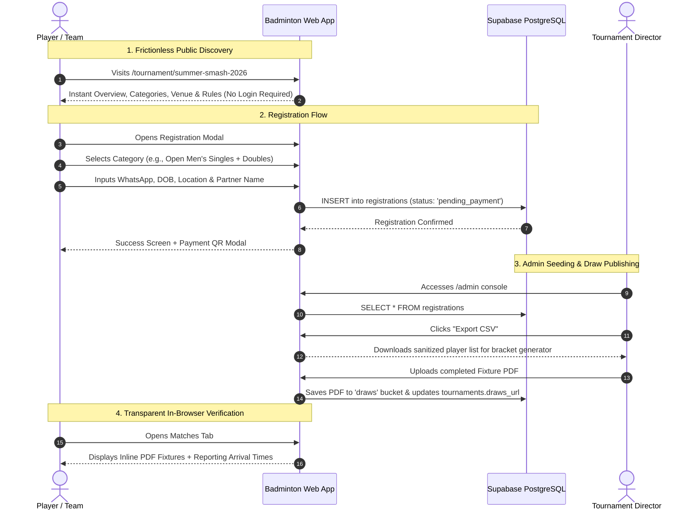

# 🏸 Badminton Tournament Pro (Shuttlers Badminton Tournament)

> **The Ultimate Digital Tournament Management Ecosystem**  
> A high-performance, full-stack web platform built for grassroots, youth, open, and veteran badminton championships. Designed for frictionless player discovery, automated multi-division registration, real-time draw bracket visualization, and one-click organizer administration.

[](https://nextjs.org/)
[](https://react.dev/)
[](https://www.typescriptlang.org/)
[](https://tailwindcss.com/)
[](https://supabase.com/)
[](https://github.com/oframe/ogl)
[](https://vercel.com/)

---

## 📑 Table of Contents
1. [Executive Summary & Core Mission](#1-executive-summary--core-mission)
2. [End-to-End System Architecture](#2-end-to-end-system-architecture)
3. [Exhaustive Tech Stack Inventory](#3-exhaustive-tech-stack-inventory)
4. [Database Architecture & Supabase Schemas](#4-database-architecture--supabase-schemas)
5. [Detailed Route & Page Audit](#5-detailed-route--page-audit)
6. [Component Subsystems & UI Architecture](#6-component-subsystems--ui-architecture)
7. [Core Business Rules & Operational Workflows](#7-core-business-rules--operational-workflows)
8. [Data Analytics Extension Blueprint](#8-data-analytics-extension-blueprint)
9. [Project Directory & File Structure](#9-project-directory--file-structure)
10. [Local Development, Environment & Deployment](#10-local-development-environment--deployment)
11. [Roadmap & Milestone Progression](#11-roadmap--milestone-progression)

---

## 1. Executive Summary & Core Mission

Grassroots and regional badminton tournaments frequently suffer from operational bottlenecks: chaotic Excel fixtures, lack of match time transparency, fragmented WhatsApp group messages, and cumbersome mandatory app installations.

**Badminton Tournament Pro** solves this by establishing a web-native, zero-friction tournament hub:
* **For Players:** Zero-barrier discovery (no mandatory login to browse rules, categories, fees, or prize pools), instant multi-division registration, real-time match reporting times, and in-browser draw fixture viewing.
* **For Organizers:** Automated participant tracking, one-click CSV export ready for tournament seeding algorithms, direct PDF bracket publishing, and verified player check-ins.
* **For Sponsors & Guests:** High-visibility digital banner showcases, marquee placements, and dedicated partner showcases.
* **For Fans & Spectators:** Live mobile-responsive schedules, category filtering, and transparent fixture updates.

---

## 2. End-to-End System Architecture



### Architectural Principles:
1. **Hybrid Rendering:** Public landing pages and tournament discovery utilize Next.js Server Components for instantaneous SEO and maximum performance. Dynamic state (draw category selector, registration modal, admin search) leverages high-performance React 19 Client Components.
2. **Server-Side Session Synchronization:** `@supabase/ssr` guarantees encrypted session cookies remain synchronized between client-side user interactions and edge-based server actions.
3. **Data Isolation via Row Level Security (RLS):** Read operations on tournaments and official draws are 100% public, whereas registration records and admin operations are locked down via PostgreSQL RLS policies tied to `auth.users.id` and verified organizer roles.

---

## 3. Exhaustive Tech Stack Inventory

### Frontend Subsystems
| Tool / Library | Version | Exact Purpose & Architecture Role |
| :--- | :--- | :--- |
| **Next.js** | `16.3.0` | Application framework using App Router, React Server Components, Route Handlers, and build optimization. |
| **React** | `19.2.8` | Next-generation React engine with automatic batching, modern hooks (`useTransition`, `useActionState`), and concurrent rendering. |
| **React DOM** | `19.2.8` | Core DOM rendering engine. |
| **TypeScript** | `5.x` | Strictly typed interfaces for all tournament models, registrations, props, and API contracts. |
| **Tailwind CSS** | `4.0` | Next-gen CSS engine powered by `@tailwindcss/postcss`. Zero runtime overhead with utility-first layout styling. |
| **OGL** | `1.0.11` | Minimal, high-performance WebGL library powering the interactive canvas noise shader (`Grainient.tsx`). |
| **Framer Motion** | `13.1.0` | Declarative spring animations, category tab switching, drawer overlays, and modal transitions. |
| **DotLottie React** | `0.19.13` | High-fidelity vector animation rendering for charts and visual badges (`@lottiefiles/dotlottie-react`). |
| **Lucide React** | `1.31.0` | Feather-style SVG sports iconography (Trophy, Calendar, MapPin, Users, Award, Shield, etc.). |
| **Google Fonts** | Native Web | `Montserrat` & `Outfit` for aggressive, athletic typography; `Inter` for crisp body copy. |

### Backend, Database & Middleware
| Tool / Library | Version | Exact Purpose & Architecture Role |
| :--- | :--- | :--- |
| **Supabase JS** | `2.112.3` | Core client library for executing PostgreSQL queries, mutations, subscriptions, and bucket uploads. |
| **Supabase SSR** | `0.12.4` | Cookie-based authentication adapter ensuring sessions persist seamlessly between Server Components, Route Handlers, and Client UI. |
| **PostgreSQL** | 15+ (Cloud) | Relational SQL database with foreign key enforcement, indexing, and transactional integrity. |
| **Next.js Route Handlers** | Native | Server-side endpoints including `/auth/callback/route.ts` for handling magic link redirects and OAuth code exchange. |
| **Edge Middleware** | Native | Intercepts protected requests (`/admin`, `/dashboard`) to refresh auth tokens and enforce authorization. |

### Storage, Telemetry & Monetization
| Tool / Library | Version | Exact Purpose & Architecture Role |
| :--- | :--- | :--- |
| **Supabase Storage** | Native | Cloud object storage hosting official fixture PDF draws (`draws` bucket) and sponsor media (`media` bucket). |
| **Vercel Analytics** | `2.0.1` | Real-time traffic, country of origin, bounce rates, and active player telemetry. |
| **Vercel Speed Insights** | `2.0.0` | Live monitoring of Core Web Vitals (FCP, LCP, CLS, INP) directly from actual user sessions. |
| **Google AdSense** | Standard | Revenue generation via crawlable [`ads.txt`](file:///c:/STUDY%20MATERIAL/.antigravity/PROJECTS/New%20badminton%20tournament/badminton-app/public/ads.txt) publisher verification. |

### Developer Tooling & Build Pipeline
| Tool | Configuration | Role |
| :--- | :--- | :--- |
| **ESLint 9** | `eslint.config.mjs` | Static code analysis enforcing clean TypeScript and Next.js best practices (`eslint-config-next`). |
| **PostCSS** | `postcss.config.mjs` | Compiles Tailwind CSS v4 directives into highly optimized browser stylesheets. |
| **Node.js** | `>=18.18.0` | Execution runtime supporting Next.js 16. |

---

## 4. Database Architecture & Supabase Schemas

### Entity-Relationship Diagram



### Table Definitions & Constraints
1. **`public.profiles`**: Synchronized with `auth.users`. Contains user demographic details and application role permissions.
2. **`public.tournaments`**: Master event record holding dates, venue particulars, total prize pool display data, and the live PDF draw link.
3. **`public.registrations`**: Transactional table logging every category entry with contact information, age verification dates, and administrative status.

### Supabase Storage Buckets
* **`draws` (Public):** Storage for official bracket schedule PDF files uploaded by organizers. Directly read by the frontend inline PDF viewer.
* **`media` (Public):** High-resolution sponsor logos, tournament banners, and event photograph galleries.

### Row Level Security (RLS) Matrix
| Table | Operation | Public / Guest | Authenticated Player | Admin / Organizer |
| :--- | :---: | :---: | :---: | :---: |
| **`tournaments`** | SELECT | Allowed | Allowed | Allowed |
| **`tournaments`** | INSERT/UPDATE | Denied | Denied | Allowed (Organizer ID match) |
| **`registrations`** | SELECT | Denied | Allowed (Own records only) | Allowed (All records) |
| **`registrations`** | INSERT | Denied | Allowed (Self registration) | Allowed |
| **`registrations`** | UPDATE | Denied | Denied | Allowed (Status & check-in changes) |
| **`profiles`** | SELECT/UPDATE | Denied | Allowed (Self profile only) | Allowed (Read all) |

---

## 5. Detailed Route & Page Audit

### 1) Public Landing Page (`/`)
* **Hero Banner:** Dynamic headline, high-contrast CTA buttons (*"View Tournaments"*, *"Register Now"*), and live date badges.
* **Grainient Shader Canvas:** Real-time WebGL noise background creating a sleek athletic dark-mode presence.
* **Sponsor & Prize Marquee:** Auto-rotating presentation showing chief guests, equipment partners, and ₹70,000 cash prizes.
* **Bento Grid Feature Showcase:** Highlighting instant fixture draws, WhatsApp court alerts, and nutritional food stalls.

### 2) Dynamic Tournament Hub (`/tournament/[id]`)
* **Multi-Tab Architecture:**
  * **Overview Tab:** Dates, venue guidelines, shuttlecock specifications (Feather/Nylon), tournament rules, and prize breakdown.
  * **Matches Tab:** Interactive category selector with 30+ divisions and embedded **Inline PDF Fixture Viewer** with full-screen zoom and reporting time lightbox.
  * **Sponsors Tab:** Grid showcase of tournament partners, equipment brands, and local business sponsors.
  * **Social Tab:** Community gallery, player quotes, and social media share buttons.
* **Interactive Registration Modal:**
  * Live category multi-select with automated entry fee calculation.
  * Captures: Full Name, WhatsApp Number, DOB, Gender, Location, and Partner Name for doubles.
  * Direct transactional insertion into Supabase `registrations`.

### 3) Authenticated Player Portal (`/dashboard`)
* Displays all categories registered by the logged-in player.
* Real-time badges for registration state (`pending_payment`, `confirmed`, `checked_in`).
* Modal containing instant UPI QR codes and bank transfer instructions for fee settlement.

### 4) Organizer Admin Center (`/admin`)
* **Role Verification:** Restricted strictly to registered tournament organizers and system administrators.
* **Live Search & Filter:** Instant multi-column query engine across player name, partner, category, or WhatsApp phone.
* **Seeding Export Engine:** One-click CSV export generating sanitized player rosters formatted for tournament bracket generation software.
* **Direct Draw PDF Publisher:** File upload dropzone that updates Supabase Storage and updates `tournaments.draws_url` in real time.

### 5) Authentication Engine (`/login`, `/signup`, `/auth/callback`)
* Passwordless **Email Magic Link** and email/password sign-in.
* Next.js Edge Route Handler ([`route.ts`](file:///c:/STUDY%20MATERIAL/.antigravity/PROJECTS/New%20badminton%20tournament/badminton-app/src/app/auth/callback/route.ts)) exchanges temporary auth tokens for long-lived, encrypted HTTP-only session cookies.

### 6) Organizer SaaS Waitlist (`/organize`)
* Teaser landing page targeted at club owners and independent tournament directors to pre-register for upcoming SaaS hosting tools.

---

## 6. Component Subsystems & UI Architecture

### 1. `Grainient.tsx` (Interactive WebGL Shader)
* Implemented using **OGL** (`ogl` v1.0.11).
* Compiles custom vertex and fragment shaders that render continuous, non-repeating simplex noise gradients at 60 FPS without impacting main thread DOM operations.

### 2. `FeaturesSection.tsx` (Bento-Grid)
* Glassmorphic cards with responsive CSS hover transformations (`transform: translateY(-4px)`), gradient borders, and subtle drop shadows (`shadow-2xl`).

### 3. `AuthNavButton.tsx` (Dynamic Header State)
* Mounts on the client, probes current Supabase session state, and seamlessly toggles between showing a login button or a user avatar dropdown linking to `/dashboard` and logout.

### 4. `AnalyticsLottie.tsx` & `BarGraphLottie.tsx`
* High-performance vector animation widgets powered by `@lottiefiles/dotlottie-react`, rendering smooth data visualizers without heavy image assets.

### 5. `FramesPlayer.tsx`
* Frame-by-frame vector sequence animation player engineered for interactive athletic visual demonstrations.

---

## 7. Core Business Rules & Operational Workflows



### Essential Business Rules:
1. **WhatsApp Primary Contact:** The player's WhatsApp number is treated as the operational contact point for match calls, court assignments, and bracket alerts.
2. **Multi-Category Validation:** Players can register for both Singles and Doubles in a single session; the system calculates the combined fee automatically.
3. **No-Download PDF Viewing:** Draw fixture PDFs are rendered inline within a high-contrast modal to save mobile players from downloading large files.
4. **Data Portability:** Organizers can download CSV rosters at any time for offline seeding, court scheduling, or printouts.

---

## 8. Data Analytics Extension Blueprint

The platform includes an architectural blueprint to incorporate comprehensive tournament telemetry:
* **Demographic Analytics:** Age distribution histograms (U-9 through 130+ Masters) and geographic origin breakdown.
* **Registration Velocity:** Sign-up trends over time relative to registration deadlines.
* **Match & Court Efficiency:** Average duration per match (Singles vs Doubles) and court utilization percentages.
* **Proposed Analytics Stack:** Integration of `recharts` for responsive SVG graphs combined with PostgreSQL Materialized Views.

---

## 9. Project Directory & File Structure

```text
badminton-app/
├── public/                         # Static assets, sponsor banners, ads.txt
│   ├── ads.txt                     # Google AdSense publisher verification
│   └── ...                         # Sponsor logos and graphic assets
├── src/
│   ├── proxy.ts                    # Network proxy helpers
│   ├── app/
│   │   ├── layout.tsx              # Root HTML shell, fonts & Vercel telemetry
│   │   ├── globals.css             # Tailwind v4 base styles and CSS variables
│   │   ├── page.tsx                # Public home page (Hero, Marquee, Bento Grid)
│   │   ├── FramesPlayer.tsx        # Dynamic vector frame animation player
│   │   ├── admin/
│   │   │   └── page.tsx            # Admin console (Rosters, CSV export, PDF upload)
│   │   ├── auth/
│   │   │   └── callback/
│   │   │       └── route.ts        # Supabase OAuth and magic link token exchange
│   │   ├── dashboard/
│   │   │   ├── layout.tsx          # Player dashboard wrapper layout
│   │   │   └── page.tsx            # Player entries and payment settlement modal
│   │   ├── login/
│   │   │   └── page.tsx            # Sign-in & Magic Link authentication
│   │   ├── organize/
│   │   │   └── page.tsx            # Organizer SaaS preview & waitlist capture
│   │   ├── signup/
│   │   │   └── page.tsx            # New player account creation
│   │   └── tournament/
│   │       └── [id]/
│   │           ├── page.tsx        # Tournament hub (Overview, Matches, Sponsors)
│   │           └── register/
│   │               └── page.tsx    # Standalone registration entry route
│   ├── components/
│   │   ├── AnalyticsLottie.tsx     # Vector stats widget
│   │   ├── AuthNavButton.tsx       # Dynamic header auth state switcher
│   │   ├── BarGraphLottie.tsx      # Vector performance graph widget
│   │   ├── ClientHomeButton.tsx    # Floating navigation button
│   │   ├── ContactModalButton.tsx  # Organizer support dialog
│   │   ├── FeaturesSection.tsx     # Glassmorphic Bento-grid feature cards
│   │   ├── Grainient.css           # WebGL shader canvas styling
│   │   └── Grainient.tsx           # WebGL OGL noise shader component
│   └── lib/
│       └── supabase/
│           ├── client.ts           # Browser Supabase client
│           ├── middleware.ts       # Edge route session guard & cookie sync
│           └── server.ts           # Server component authenticated client
├── eslint.config.mjs               # ESLint 9 configuration
├── next.config.ts                  # Next.js configuration
├── package.json                    # Dependencies, scripts & engine specifications
├── postcss.config.mjs              # PostCSS plugins for Tailwind CSS v4
└── tsconfig.json                   # TypeScript compiler options
```

---

## 10. Local Development, Environment & Deployment

### System Prerequisites
* **Node.js:** `v18.18.0` or higher
* **Package Manager:** `npm` (v9+) or `pnpm`
* **Supabase Project:** Active Supabase instance with PostgreSQL and Storage enabled

### 1. Installation
```bash
# Clone the repository
git clone https://github.com/your-username/badminton-tournament.git

# Navigate into the web application directory
cd "badminton-tournament/badminton-app"

# Install all dependencies
npm install
```

### 2. Environment Variables Configuration
Create a `.env.local` file in `badminton-app/`:
```env
# Supabase Configuration
NEXT_PUBLIC_SUPABASE_URL=https://your-project-id.supabase.co
NEXT_PUBLIC_SUPABASE_ANON_KEY=your-supabase-anon-key

# Optional: Service Role Key (for administrative migrations only)
# SUPABASE_SERVICE_ROLE_KEY=your-service-role-key
```

### 3. Running the Development Server
```bash
npm run dev
```
Open [http://localhost:3000](http://localhost:3000) in your browser.

### 4. Running Lint Checks & Production Build
```bash
# Run ESLint validation
npm run lint

# Compile optimized production bundle
npm run build

# Start production server
npm run start
```

### 5. Deployment Guide (Vercel)
1. Push your repository to GitHub, GitLab, or Bitbucket.
2. Import the project into **Vercel** with the Root Directory set to `badminton-app`.
3. Add `NEXT_PUBLIC_SUPABASE_URL` and `NEXT_PUBLIC_SUPABASE_ANON_KEY` to Vercel's Environment Variables.
4. Deploy. Vercel automatically activates Edge caching, `@vercel/analytics`, and `@vercel/speed-insights`.

---

## 11. Roadmap & Milestone Progression

* [x] **Phase 1: Public Discovery & Athletic Visual Brand**
  * Next.js 16 App Router setup with Tailwind CSS v4.
  * Interactive WebGL Grainient shader canvas and Bento-grid features.
  * Responsive tournament hub with multi-tab layout and sponsor marquee.
* [x] **Phase 2: Authentication, Registrations & Admin Console**
  * Supabase Auth integration with Edge cookie handling.
  * Multi-category registration modal with 30+ divisions and fee computation.
  * Authenticated player dashboard with UPI QR payment instructions.
  * Organizer `/admin` console with real-time roster search, CSV export, and PDF draw upload.
* [ ] **Phase 3: Real-Time Scoring & Automated Knockout Engine**
  * Digital umpire scoring interface with live point updates.
  * Automatic knockout bracket generation (Byes, Quarterfinals, Semifinals, Finals).
* [ ] **Phase 4: Advanced Demographics & Operational Analytics**
  * Demographics dashboard featuring interactive SVG charts.
  * Court efficiency and match duration trackers.
* [ ] **Phase 5: Automated WhatsApp Bot Notifications**
  * Automated WhatsApp alerts via Twilio/Meta webhooks notifying players 15 minutes before their match.

---

## 📄 License & Attribution
Developed for the **Shuttlers Badminton Tournament** community. Released under the [MIT License](LICENSE).
